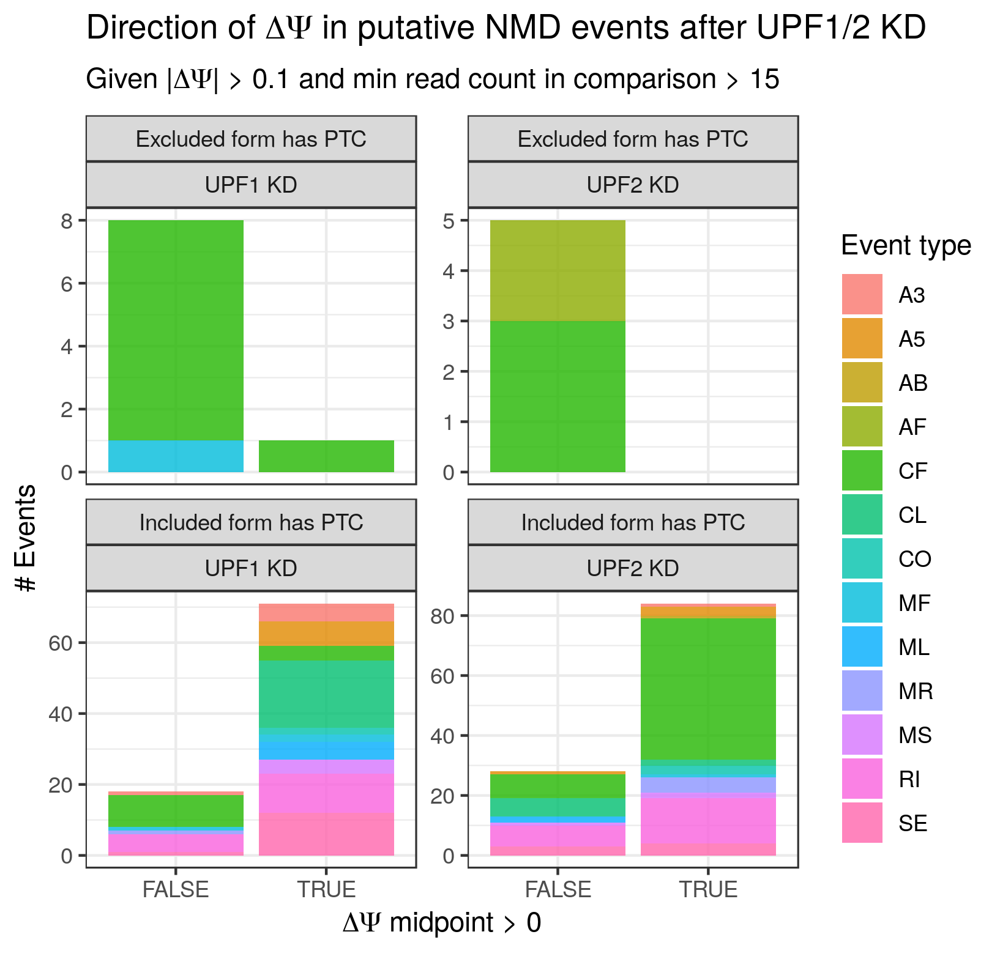

# cds_insertion

cds\_insertion is intended to add CDS features to transcriptome annotations lacking them (referred to later as the "raw" transcriptome annotation) (e.g. a GTF file generated by a transcript assembler such as stringtie (https://ccb.jhu.edu/software/stringtie/).  cds\_insertion accomplishes this by taking as input the raw transcriptome annotation as well as a separate transcriptome annotation that includes CDS features (e.g. GENCODE https://www.gencodegenes.org/), identifying overlaps between the raw transcriptome exons and annotated CDS start codons, and then translating the raw transcriptome transcripts (_in silico_) from the overlapping annotated start codons. Future versions will accept a bed file of start codon coordinates in lieu of a full annotation. The idea is to restrict inserted CDS features to those derived from start codons to those for which there is strong evidence of utilization (e.g. conservation, known protein sequences, evidence from Ribo-seq or similar) rather than inserting another layer of arbitrary decisions by performing de novo CDS predictions. cds\_insertion additionally identifies a number of transcript properties derived from the presence/properties of the CDS such as the UTR lengths and the presence/absence of a premature termination codon.  

  
*An example of an unannotated premature termination codon-containing transcript identified by running `cds_insertion.py` on a stringtie-augmented transcriptome GTF. The PTC is caused by an unannotated retained intron highlighted in red. Visualized bigGenePred file generated by cds_insertion (via Kent utils - see below) on the UCSC Genome Browser*  
  
  

  
*Zoomed-in view of the PTC-containing region described above*  

## Basic Requirements

python 2.7  
Bedtools v>=2.27  

## Basic usage:

```
python2.7 /path/to/cds_insertion.py --transcript_gtf /path/to/raw/transcriptome.gtf --transcript_fasta /path/to/raw/transcriptome.fa --annotation_gtf /path/to/cds_annotated_transcriptome.gtf --outdir /path/to/output/`
```

Note that this assumes that bedtools is in your PATH. The location of the bedtools executable can be made explicit by adding `--bedtools\_path /path/to/bedtools`

## Restrict to CCDS

The `--CCDS` flag will require that annotation CDS entries contain the text "CCDS".  This is intended for use with a GENCODE annotation GTF, and will have the affect of using only start codons from consensus CDS features (https://www.ncbi.nlm.nih.gov/pmc/articles/PMC5753299/).

```
python2.7 /path/to/cds_insertion.py --transcript_gtf /path/to/raw/transcriptome.gtf --transcript_fasta /path/to/raw/transcriptome.fa --annotation_gtf /path/to/cds_annotated_transcriptome.gtf --outdir /path/to/output/ --CCDS`
```

## Primary output files

### transcript_characteristics.tsv

This file provides basic transcript CDS information such as number of putative CDS, whether any truncated CDS are found (start codon with no in-frame stop), whether or not the transcript is a putative NMD substrate (based on max PTC distance >= 55nt), CDS lengths, UTR lengths, etc.

Here is an example of the file with field descriptions to follow:

| gene        | transcript_id | normal_cds_count | nonstop_cds_count | always_nmd | sometimes_nmd | always_nonstop | sometimes_nonstop | PTC_distances | max_downstream_PTC_distances | CDS_lengths | five_utr_lengths | three_utr_lengths | three_utr_junction_counts | junction_contained_three_utr_lengths |
|-------------|---------------|------------------|-------------------|------------|---------------|----------------|-------------------|---------------|------------------------------|-------------|------------------|-------------------|---------------------------|--------------------------------------|
| ZNF746      | MSTRG.24752.1 | 1                | 0                 | FALSE      | FALSE         | FALSE          | FALSE             | 0             | 0                            | 1935        | 271              | 1591              | 0                         | 0                                    |
| ZNF746      | MSTRG.24752.2 | 1                | 0                 | FALSE      | FALSE         | FALSE          | FALSE             | 0             | 0                            | 1980        | 271              | 1591              | 0                         | 0                                    |
| ZNF746      | MSTRG.24752.3 | 1                | 0                 | FALSE      | FALSE         | FALSE          | FALSE             | 0             | 0                            | 1977        | 271              | 1591              | 0                         | 0                                    |
| MSTRG.22509 | MSTRG.22509.1 | 0                | 0                 | FALSE      | FALSE         | FALSE          | FALSE             | NA            | NA                           | NA          | NA               | NA                | NA                        | NA                                   |
| MSTRG.28358 | MSTRG.28358.1 | 0                | 0                 | FALSE      | FALSE         | FALSE          | FALSE             | NA            | NA                           | NA          | NA               | NA                | NA                        | NA                                   |
| MSTRG.18752 | MSTRG.18752.1 | 0                | 0                 | FALSE      | FALSE         | FALSE          | FALSE             | NA            | NA                           | NA          | NA               | NA                | NA                        | NA                                   |
| MSTRG.11041 | MSTRG.11041.1 | 0                | 0                 | FALSE      | FALSE         | FALSE          | FALSE             | NA            | NA                           | NA          | NA               | NA                | NA                        | NA                                   |
| RGS5        | MSTRG.1910.1  | 2                | 0                 | FALSE      | FALSE         | FALSE          | FALSE             | 0,0           | 0,0                          | 219543      | 602278           | 5041,5041         | 0,0                       | 0,0                                  |
| KRCC1       | MSTRG.14117.1 | 1                | 0                 | FALSE      | FALSE         | FALSE          | FALSE             | 0             | 0                            | 777         | 525              | 582               | 0                         | 0                                    |

`gene` (string): gene symbol  
  
`transcript_id` (string): transcript id  
  
`normal_cds_count` (integer): number of "normal" (i.e. terminating in a stop codon rather than the end of the transcript) CDS found by translating overlapping annotated start codons  
  
`nonstop_cds_count` (integer): number of "nonstop" (i.e. terminating in the end of the transcript rather than a stop codon) CDS found by translating overlapping annotated start codons  
  
`always_nmd` (logical): TRUE/FALSE indicating whether the transcript contains a putative PTC with max distance >= 55 nt when translated from ALL overlapping annotated start codons  
  
`sometimes_nmd` (logical): TRUE/FALSE indicating whether the transcript contains a putative PTC with max distance >= 55 nt when translated ANY overlapping annotated start codons (note that any transcript that is "always\_nmd" is necessarily also "sometimes\_nmd"  
  
`always_nonstop` (logical): TRUE/FALSE indicating whether the ALL CDS generated by translating overlapping annotated start codons lack a stop codon (i.e. terminate at the 3'-end of the transcript)  
  
`sometimes_nonstop` (logical): TRUE/FALSE indicating whether ANY CDS generated by translating overlapping annotated start codons lack a stop codon (note that "always\_nonstop" transcripts are necessarily also "sometimes\_nonstop")  
  
`PTC_distances` (string containing comma-separated list of integers): distance of the putative PTC (if applicable) to the nearest downstream exon-exon junction. If there is more than one PTC (due to more than one CDS), all PTC distances are represented in a comma-separated list. Note also that non-PTC containing transcripts will have "0" in this field. In future iterations this may be changed to "NA".  
  
`max_downstream_PTC_distances` (string containing comma-separated list of integers): distance of the putative PTC (if applicable) to the farthest downstream exon-exon junction. Note that these values are important because a PTC (for example) only 3 nt upsream of the nearest exon-exon junction may still satistfy NMD criteria if the farthest downstream exon-exon junction is >= 55 nt away. Even if the ribosome displaces the proximal EJC the remaining downstream EJC(s) may still aid in recruitment of NMD machinery. If there is more than one PTC (due to more than one CDS), all PTC distances are represented in a comma-separated list. Note also that non-PTC containing transcripts will have "0" in this field. In future iterations this may be changed to "NA".  
  
`CDS_lengths` (string - comma separated list of integers): lengths of CDS found by translating overlapping annotated start codons  
  
`five_utr_lengths` (string - comma separated list of integers): lengths of 5'-UTRs resulting from CDS found by translating overlapping annotated start codons  
  
`three_utr_lengths` (string - comma separated list of integers): lengths of 3'-UTRs resulting from CDS found by translating overlapping annotated start codons  
  
`three_utr_junction_counts` (string - comma separated list of integers): Number of exon-exon junctions in the 3'-UTR(s)  
  
`junction_countained_three_utr_lengths` (string - comma separated list of integers): length of 3'-UTR up until the final exon-exon junction. This is equivalent to `max_downstream_PTC_distances` and will likely be removed in future versions  

### transcript_aa_seq.tsv

### .gtf files

`cds_inserted_no_ptc.gtf`: GTF file of transcripts with inserted CDS features. Contains transcripts which do not have a putative PTC. Note that there is a separate set of entries (transcript, exon, CDS features) for each separate CDS associated with the transcript. These separate entries will be denoted by a number following the original transcript ID in the transcript_id feature. (e.g. if the transcript MSTRG.1.1 has two possible CDS they will be given separate entries MSTRG.1.1\_0 and MSTRG.1.1\_1)
`cds_inserted_ptc.gtf`: GTF file of transcripts with inserted CDS features. Contains transcripts with a putative PTC.
`cds_inserted_nonstop.gtf`: GTF file of transcripts with inserted CDS features. Contains transcripts with putative CDS that lack a stop codon (i.e. they terminate at the 3'-end of the transcript)

### cds_insertion_transcript_dict.pkl


## bigGenePred generation

By default cds\_insertion will output new GTF files with CDS entries, but for some visualization purposes it is nice to have bigGenePred files, which allow individual codon coloring when viewed on the UCSC genome browser. Generating the bigGenePred files requires the following UCSC utilities (by Jim Kent): `bigGenePred`, `gtfToGenePred`, `bedToBigBed`, and `genePredToBigGenePred`. These are available for linux and MacOS here: http://hgdownload.soe.ucsc.edu/admin/exe/. Provided those utilities are available in your `PATH`, the only necessary modifications to the above command are `--make\_bigBed`, `--bigGenePred\_as_path /path/to/bigGenePred.as` and `--chrNameLength_path /path/to/chrNameLength.txt`.  The `chrNameLength.txt` file is just a two-column tsv containing chromosome name in the first column and chromosome length in the second. Note that this is just the first two columns of a `.fai` file such as is generated by `samtools faidx`.  The `bigGenePred.as` file can be downloaded here: https://genome.ucsc.edu/goldenpath/help/bigGenePred.html.  

The bigGenePred generation can be achieved (alongside the normal output) as follows:

```
python2.7 /path/to/cds_insertion.py --transcript_gtf /path/to/raw/transcriptome.gtf --transcript_fasta /path/to/raw/transcriptome.fa --annotation_gtf /path/to/cds_annotated_transcriptome.gtf --outdir /path/to/output/ --make_bigBed --bigGenePred_as_path /path/to/bigGenePred.as --chrNameLength_path /path/to/chrNameLength.txt`
```

Note that paths to the UCSC executables can be made explicit using `--gtfToGenePred_path` and equivalent for the rest.


## Help statement

usage: cds_insertion.py [-h] --transcript_gtf TRANSCRIPT_GTF  
                        --transcript_fasta TRANSCRIPT_FASTA --annotation_gtf  
                        ANNOTATION_GTF [--CCDS] --outdir OUTDIR  
                        [--bigGenePred_as_path BIGGENEPRED_AS_PATH]  
                        [--gtfToGenePred_path GTFTOGENEPRED_PATH]  
                        [--genePredToBigGenePred_path GENEPREDTOBIGGENEPRED_PATH]  
                        [--bedToBigBed_path BEDTOBIGBED_PATH]  
                        [--bedtools_path BEDTOOLS_PATH]  
                        [--chrNameLength_path CHRNAMELENGTH_PATH]  
                        [--make_bigBed] [--ptc_dist PTC_DIST]  
  
optional arguments:  
  -h, --help            show this help message and exit  
  --transcript_gtf TRANSCRIPT_GTF  
                        Input transcript gtf filename  
  --transcript_fasta TRANSCRIPT_FASTA  
                        Input transcript fasta (assumes generation with  
                        gffread)  
  --annotation_gtf ANNOTATION_GTF  
                        Input gtf filename that contains CDS (preferably CCDS)  
                        features  
  --CCDS                If set, CDS used will be restricted to CCDS.  
  --outdir OUTDIR       Path for output files  
  --bigGenePred_as_path BIGGENEPRED_AS_PATH  
                        Path to bigGenePred.as file  
  --gtfToGenePred_path GTFTOGENEPRED_PATH  
                        Path to gtfToGenePred exe  
  --genePredToBigGenePred_path GENEPREDTOBIGGENEPRED_PATH  
                        Path to genePredToBigGenePred exe  
  --bedToBigBed_path BEDTOBIGBED_PATH  
                        Path to bedToBigBed exe  
  --bedtools_path BEDTOOLS_PATH  
                        Path to bedtools exe  
  --chrNameLength_path CHRNAMELENGTH_PATH  
                        Path to chrNameLength file  
  --make_bigBed         If set, will attempt to use Kent utils to output  
                        bigbed file from gtfs. Requires chrNameLength_path and  
                        bigGenePred_as_path to be set. If Kent utils are not  
                        in PATH, set the paths to the executables as well.  
  --ptc_dist PTC_DIST   Set minimum PTC distance required for transcript to be  
                        considered putative NMD substrate. default = 55  


# find_switch_events

find\_switch\_events is intended to identify alternative splicing events that switch between putative NMD or NSD substrates and non-substrates. The required input files are the .pkl file output by `cds_insertion`, an event gtf file (such as one generated by `infer_pairwise_events.py`), and an event ioe file (generated either by `infer_pairwise_events.py` or `generateIOE.py`). The script outputs a table with information on whether the event is an NMD or NSD switch event and whether (in the case of an NMD switch event) the alternative region of the putative NMD-substrate form contains the PTC.

## Basic requirements

python2.7

## Basic usage

```
python2.7 find_switch_events.py --outdir /path/to/output_dir/ --ioe_file /path/to/splice_lib_events.ioe --event_gtf /path/to/splice_lib_events.gtf --transcript_dict_pkl /path/to/cds_insertion_transcript_dict.pkl
```

## Help statement

usage: find_switch_events.py [-h] [--suppress_output] [--outdir OUTDIR]  
                             [--ioe_file IOE_FILE] [--event_gtf EVENT_GTF]  
                             [--transcript_dict_pkl TRANSCRIPT_DICT_PKL]  
  
optional arguments:  
  -h, --help            show this help message and exit  
  --suppress_output     If set, not file will be output  
  --outdir OUTDIR       Output directory  
  --ioe_file IOE_FILE   Event ioe file  
  --event_gtf EVENT_GTF  
                        Event gtf file - required for certain features to work  
                        e.g. PTC overlap determination if standard_event_dict  
                        not supplied as argument to main()  
  --transcript_dict_pkl TRANSCRIPT_DICT_PKL  
                        Pickled transcript dict from cds_insertion.py.  
                        Required for certain features to work e.g. PTC overlap  
                        determinatino if standard_transcript_dict not supplied  
                        as argument to main() 

# generateIOE

generateIOE is a script that can be used to generate an event ioe file from an event gtf and a transcript gtf. While the ioe file is normally generated during creation of an event file, there are circumstances under which this cannot occur (such as when an event annotation is created by cross-species mapping of events). 

## Basic requirements

python2.7

## Basic usage

```
python2.7 generateIOE.py --transcript_gtf /path/to/transcriptome.gtf --event_gtf /path/to/splice_lib_events.gtf --outdir /path/to/output_dir/
``` 

## Primary output files

### event_nmd_nsd_status.tsv

| event_id                                      | nmd_status | nmd_form | ptc_overlap | nonstop_status | nonstop_form |
|-----------------------------------------------|------------|----------|-------------|----------------|--------------|
| human_chimpanzee_orangutan_macaque\|A5.0060093 | never_nmd  | NA       | NA          | never_nsd      | NA           |
| human_chimpanzee_orangutan_macaque\|RI.0044820 | never_nmd  | NA       | NA          | never_nsd      | NA           |
| human_chimpanzee_orangutan_macaque\|SE.0023738 | never_nmd  | NA       | NA          | never_nsd      | NA           |
| human_chimpanzee_orangutan_macaque\|A3.0022901 | always_nmd | excluded | FALSE       | never_nsd      | NA           |
| human_chimpanzee_orangutan_macaque\|RI.0077570 | never_nmd  | NA       | NA          | never_nsd      | NA           |
| human_chimpanzee_orangutan\|RI.0036360         | never_nmd  | NA       | NA          | never_nsd      | NA           |
| human_chimpanzee_orangutan_macaque\|SE.0023125 | never_nmd  | NA       | NA          | never_nsd      | NA           |
| human_chimpanzee_orangutan_macaque\|SE.0059404 | always_nmd | included | TRUE        | never_nsd      | NA           |


`event_id` (string): unique identifier for each alt splicing event  
  
`nmd_status` (categorical with possibilities `always_nmd`, `sometimes_nmd`, `ambiguous_nmd`, and `never_nmd`): Describes the putative NMD status of the event. "always\_nmd" events are those in which one isoform is only consistent with transcripts having a putative PTC (when translated from any overlapping annotated start codon provided in `cds_insertion.py`), while the other isoform is only consistent with events _lacking_ a putative PTC. The behavior of these events is therefore expected to report on changes in NMD. "sometimes\_nmd" events are similar to `always_nmd` events, but the requirements are loosened: one of the isoforms must be consistent with at least one transcript with a putative PTC (again, translated using any putative ORF inserted by `cds_insertion.py`), while the other isoform must only be consistent with transcripts lacking a PTC. `ambiguous_nmd` events are those in which both isoforms are consistent with one or more transcripts. `never_nmd` events are those in which neither isoform is consistent with any transcripts with any putatively PTC-terminated ORFs (given available data).  
  
`nmd_form` (categorical with possibilities "included" or "excluded"): Indicates which event isoform is consistent with putative NMD substrates. This value is only supplied for events with `always_nmd` or "sometimes\_nmd" status. Otherwise it is left as "NA", including for `ambiguous_nmd` cases (in which both isoforms are presumptive substrates).  
   
`ptc_overlap` (logical): Indicates whether the alternative region (e.g. the cassette exon in the case of a skipped exon (SE) event) contains all of the putative PTCs. It is only supplied for "always\_nmd" events, and is otherwise "NA".   
  
`nonstop_status` (categorical with possibilities `always_nonstop`, `sometimes_nonstop`, `ambiguous_nonstop`, and `never_nonstop`): Indicates putative nonstop (referring to nonstop decay) switch status. `always_nonstop` events are those in which one isoform is only consistent with transcripts whose complement of ORFs does not terminate in stop codons, while the other isoform is only consistent with transcripts whose complement of ORFs all contain stop codons. `sometimes_nonstop` events are those in which one isoform is consistent with transcripts whose complement of ORFs sometimes lack a stop codon, while the other isoform is only consistent with transcripts lacking truncated ORFs. `ambiguous_nonstop` events are those in which both isoforms are consistent with at least one transcript that contains at least one truncated ORF. `never_nonstop` events are those in which neither isoform is consistent with any transcript that contains any truncated ORFs (given available data).  
  
`nonstop_form` (categorical with possible values "included" or "excluded"): Similar to `nmd_form`. This indicates the form of `always_nonstop` or `sometimes_nonstop` events that is putatively an NSD substrate. This value is "NA" for all other values of `nonstop_status`.  

## Validation  

  

  

  

## Help statement

usage: generateIOE.py [-h] [--transcript_gtf TRANSCRIPT_GTF]o_access_the_public_servers  
                      [--event_gtf EVENT_GTF] [--outdir OUTDIR]   
                      [--prefix PREFIX]/people/anjowall/projects/primate_neurodiff/  

optional arguments:  
  -h, --help            show this help message and exit  
  --transcript_gtf TRANSCRIPT_GTF  
                        Full transcript gtf file  
  --event_gtf EVENT_GTF  
                        Event gtf  
  --outdir OUTDIR       Path to output directory  
  --prefix PREFIX       Prefix for output files  


  
